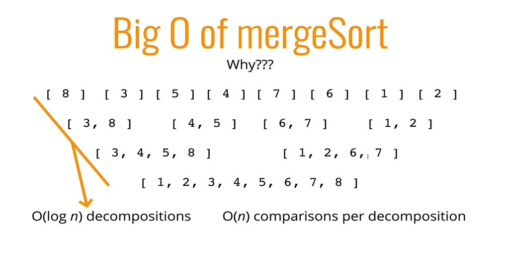

---
jupyter:
  jupytext:
    text_representation:
      extension: .Rmd
      format_name: rmarkdown
      format_version: '1.2'
      jupytext_version: 1.3.1
  kernelspec:
    display_name: Python 3
    language: python
    name: python3
---

# Merge Sort

Merge sort consist of splitting the initial input into arrays with only one element and then mergin sorted elements "on the way up". The "tricky" part of the algorithm is the creation of a sorted array from two sorted arrays, which have an O(x) of O(n+m), where n is the size of the first array and m is the size of the second array. 


## Implementetion of merging sorted arrays algorithm

```{python}
# Implementation 1

# Note the use of two variables to keep track of the index (this makes the algorithm O(n+m))
#

def return_sorted(array1, array2):
    results = []
    # Here!!
    i = 0
    j = 0
    # ------
    while i < len(array1) and j < len(array2):
        if array1[i] < array2[j]:
            results.append(array1[i])
            i += 1
        else:
            results.append(array2[j])
            j += 1
    while i < len(array1):
        results.append(array1[i])
        i +=1
    while j < len(array2):
        results.append(array2[j])
        j += 1
    return results

# Implementation 2

# This implementation has an O(n^2) because it uses nested loops

def join_sorted(array1, array2):
    sorted = []
    while len(array1):
        while len(array2):
            min_array_2 = array2[0]
            if len(array1):
                min_array_1 = array1[0]
                if min_array_1 <= min_array_2:
                    sorted.append(array1.pop(0))
                elif min_array_2 < min_array_1:
                    sorted.append(array2.pop(0))
            else:
                sorted.extend(array2)
                break
        if len(array1):
            sorted.extend(array1)
            break
    return sorted
```

Note: Because the sorting always happens between arrays of length of 1, it's possible to simplify the algorithm above.


## Using the sorting algorithm in the merge sort

Once the algorithm that sorts elements of two sorted arrays has been written, the merge algorithm has to divide all the input into smaller arrays with length of 1 or 0 and then use the sorting algorithm to start sorting them on the "way up".

```{python}
## Helper sorting function

def return_sorted(array1, array2):
    results = []
    # Here!!
    i = 0
    j = 0
    # ------
    while i < len(array1) and j < len(array2):
        if array1[i] < array2[j]:
            results.append(array1[i])
            i += 1
        else:
            results.append(array2[j])
            j += 1
    while i < len(array1):
        results.append(array1[i])
        i +=1
    while j < len(array2):
        results.append(array2[j])
        j += 1
    return results


## first approach

def merge_sort_1(array):
    if len(array) == 1:
        return array
    else:
        mid_point = int(len(array)/2)
        first_halve = array[0:mid_point]
        second_halve = array[mid_point:]
        
        if len(first_halve) <= 1 and len(second_halve) <=1:
            return return_sorted(first_halve, second_halve)
        else:
            return return_sorted(merge_sort(first_halve), merge_sort(second_halve))


## second approach

def merge_sort_2(array):
    if len(array) <=1:
        return array
    else:
        midpoint = int(len(array)/2)
        left_part = merge_sort(array[0:midpoint])
        right_part = merge_sort(array[midpoint:])
        return return_sorted(left_part, right_part)|
```

## O(n) of Merge Sort

The o(n) of merge sort is **O(n * log n)** which is the best when it comes to sorting algorithms. **The log n part comes from splitting the array into smaller arrays** (this looks like a binary tree) and **the n part comes from the comparisons that has to be made between the arrays** (in the image, 4 in the first level, then 3 in the second level, 2 in the third level and one in the final level).


